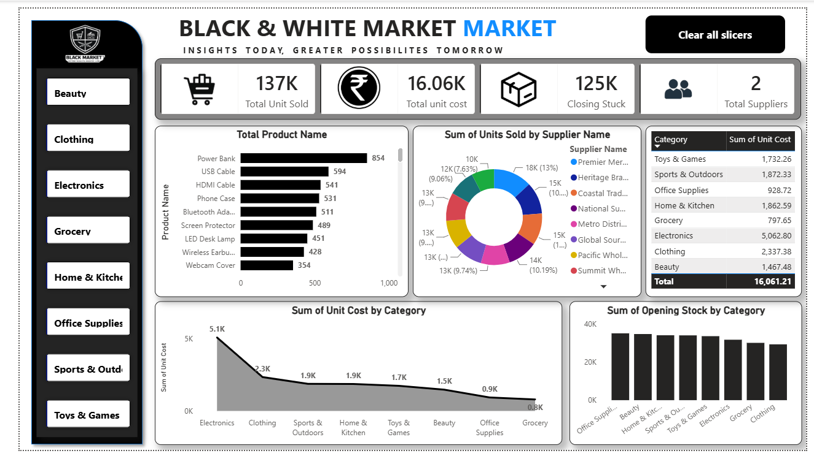

# Retail Inventory Power BI Dashboard

Interactive Power BI dashboard for analyzing retail inventory, suppliers, products and category performance.

## Dashboard Preview

## Key Analysis
- Total units sold and closing stock
- Supplier-wise units sold
- Product-wise sales performance
- Category-wise unit cost
- Opening stock by category
- Interactive category filtering

## Tools Used
- Power BI
- DAX
- Data Visualization
- Dashboard Design

## Project File
Download and open `Market Visualize.pbix` using Power BI Desktop.
